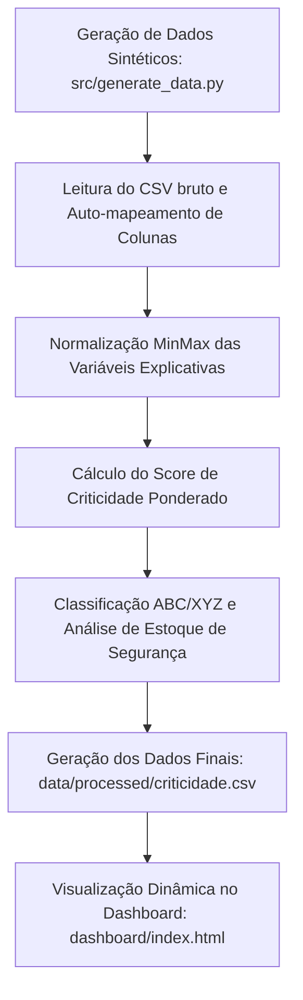

# ⚡ BOM Criticidade — Priorização Analítica de Materiais Industriais

> **Sistema interpretável para classificar materiais críticos considerando lead time, custo de parada, consumo anual, risco de substituição e cobertura de estoque.**

---

## 🎯 Problema de Negócio

Como priorizar materiais industriais em catálogos extensos, reduzindo a subjetividade e apoiando decisões estratégicas de estoque, manutenção, suprimentos e engenharia? 

Em ambientes industriais de grande porte (como plantas petroquímicas ou de fertilizantes), a indisponibilidade de um item sobressalente crítico pode paralisar uma linha de produção inteira, causando prejuízos financeiros massivos por hora de inatividade. O desafio reside em identificar de forma rápida, objetiva e escalável quais materiais merecem atenção prioritária e quais possuem estoques sobredimensionados, mitigando riscos sem inflar o capital de giro.

---

## 📊 Sumário Executivo

Este projeto cria um **score interpretável de criticidade** para apoiar a tomada de decisão em supply chain industrial. O algoritmo consolida e pondera diferentes dimensões operacionais, logísticas e financeiras. O foco principal é mapear materiais que combinam alto impacto técnico de manutenção com alta vulnerabilidade de abastecimento (longo tempo de recebimento ou estoques baixos). Com isso, gestores conseguem focar esforços de contratação, automatizar a sugestão de compras preventivas e otimizar recursos operacionais.

---

## 📌 Objetivos

1. **Classificar materiais** em faixas claras de criticidade operacional.
2. **Criar um score interpretável** entre 0.00 e 1.00 para permitir comparações objetivas.
3. **Apoiar decisões de estoque de segurança**, calculando dinamicamente o ponto de pedido.
4. **Identificar itens prioritários** para compras e contratos de fornecimento preventivos.
5. **Evidenciar itens de baixo giro** ou sobredimensionados para redução de excesso de estoque.
6. **Gerar um dashboard executivo interativo** em tempo real para análises rápidas de risco.

---

## 💾 Dados Utilizados

> [!IMPORTANT]
> Este projeto utiliza dados sintéticos gerados para simular um cenário industrial realista. Nenhum dado confidencial de empresa foi utilizado.

As variáveis principais do projeto, mapeadas e processadas pelo pipeline, são:

*   `material_id`: Identificador exclusivo do item de estoque.
*   `category`: Categoria ou grupo do item (ex: `MP` para Matéria-prima, `IP` para Insumo de processo, `SB` para Sobressalentes).
*   `supplier`: Identificador ou nome do fornecedor (padrão `N/A`).
*   `eng_crit`: Criticidade de Engenharia (avaliação técnica de 1 a 5 dada pela equipe de manutenção).
*   `lead_time_days`: Lead time de fornecimento físico do item (em dias).
*   `unit_cost`: Custo de aquisição unitário do item (em R$).
*   `stock_qty`: Saldo físico atual em estoque.
*   `daily_consumption`: Taxa de consumo médio diário do material.
*   `coverage_days`: Dias de cobertura do estoque atual (estoque atual dividido pelo consumo diário, limitado a 180 dias).
*   `annual_value`: Consumo anual valorizado (custo unitário multiplicado pelo consumo anual estimado).
*   `score`: Score ponderado final de criticidade (intervalo entre 0.00 e 1.00).
*   `risk_flag`: Flag de risco binário (1 se a cobertura de estoque for menor que o lead time de entrega, 0 caso contrário).
*   `risk_score`: Score de risco ajustado (`score * risk_flag`), evidenciando itens urgentes.
*   `abc_class`: Classificação financeira clássica de Pareto (Classe A: 80% do custo acumulado, B: 15%, C: 5%).
*   `xyz_class`: Classificação de variabilidade da demanda baseada em coeficiente de variação.
*   `suggest_qty`: Quantidade de compra sugerida com base no ponto de pedido dinâmico.

---

## 🤖 Metodologia

O pipeline de dados opera em etapas sequenciais e integradas:



1.  **Geração dos Dados:** O script `generate_data.py` gera uma lista realista de 400 itens de BOM com diferentes perfis de comportamento por categoria de material.
2.  **Mapeamento e Tratamento:** O script `etl.py` normaliza nomenclaturas e infere tipos de dados, contornando variações regionais (como separadores de milhar e decimal).
3.  **Normalização:** As variáveis numéricas de engenharia, lead time e custo são normalizadas na escala de 0 a 1 por normalização MinMax para evitar distorções de escala.
4.  **Cálculo do Score:** Aplicação de pesos lineares sobre as variáveis normalizadas.
5.  **Cálculo Logístico:** Cálculo dinâmico do estoque de segurança baseado na variabilidade da demanda, ponto de pedido e quantidade sugerida de compra.
6.  **Geração do CSV Processado:** Exportação ordenada por prioridade e criticidade de risco.
7.  **Construção do Dashboard:** Painel web construído para consumir o arquivo processado de forma reativa.

---

## 📐 Fórmula do Score

O score de criticidade final de cada item de estoque é calculado pela seguinte combinação linear ponderada das variáveis normalizadas (escala de 0.00 a 1.00):

$$\text{Score} = 0.40 \times \text{EngCrit}_{\text{norm}} + 0.30 \times \text{LeadTime}_{\text{norm}} + 0.20 \times \text{UnitCost}_{\text{norm}} + 0.10 \times (1 - \text{Coverage}_{\text{norm}})$$

*   **Criticidade de Engenharia (40%):** Maior peso atribuído à criticidade técnica de produção, protegendo os equipamentos vitais da planta.
*   **Lead Time de Fornecimento (30%):** Penaliza itens de difícil aquisição ou importados, que demoram mais para chegar.
*   **Custo Unitário (20%):** Considera a dimensão financeira direta de compra do material.
*   **Inverso da Cobertura de Estoque (10%):** Dá peso extra a itens que se encontram em níveis alarmantes de estoque frente ao consumo diário.

> [!NOTE]
> Os pesos adotados no modelo refletem premissas de negócio gerais para a indústria MRO (Manutenção, Reparo e Operações). Esses parâmetros são completamente configuráveis e podem ser adaptados sob medida em sessões de alinhamento com especialistas da área.

---

## 💡 Decisões que o Projeto Apoia

*   **Definição de Estoques de Segurança:** Ajuste dinâmico de níveis mínimos com base na classificação XYZ.
*   **Gestão de Suprimentos:** Foco prioritário de aquisições em itens de alto risco.
*   **Mitigação de Riscos logísticos:** Mapeamento de itens com lead time alto para contratos de fornecimento de longo prazo (MRO).
*   **Negociação com Fornecedores:** Focar esforços de compras em itens críticos e caros (Classe A + Alta Criticidade).
*   **Otimização de Capital de Giro:** Identificação de materiais Classe C com estoques sobredimensionados para cancelamento ou adiamento de novos pedidos.

---

## 📊 Dashboard Executivo

O painel visual contém 7 representações gráficas interativas em tempo real:

1.  **Top 20 Materiais por Criticidade:** Gráfico de barras indicando os materiais com os maiores scores de criticidade ponderados.
2.  **Distribuição de Scores:** Histograma que mapeia a quantidade de itens em faixas de score de 0.0 a 1.0, evidenciando o comportamento de cauda longa do inventário.
3.  **Dispersão Lead Time × Custo Unitário:** Gráfico de bolhas correlacionando custo e tempo de entrega, onde o raio da bolha corresponde ao score de criticidade do item.
4.  **Pareto ABC por Valor Anual:** Gráfico de barras e linha acumulada ilustrando a concentração financeira do catálogo.
5.  **Contagem por Criticidade de Engenharia:** Distribuição quantitativa dos itens pelas avaliações técnicas (1 a 5).
6.  **Risco de Stockout:** Gráfico de dispersão entre Cobertura de Estoque (eixo X) e Lead Time (eixo Y). Itens na zona vermelha (acima da linha tracejada $y=x$) estão em risco crítico de falta física antes da chegada de um novo pedido.
7.  **Curva de Pareto de Criticidade:** Relação percentual acumulada de criticidade para mapear o impacto conjunto da planta.
8.  **Tabela de Ações Recomendadas:** Lista interativa com pílulas visuais categorizadas em reabastecer agora, monitorar, rever lead time ou reduzir estoque.

---

## 🛠️ Stack Técnica

*   **Linguagem & Processamento:** Python 3.10+ (Pandas, NumPy)
*   **Front-end & Visualização:** HTML5, CSS3, JavaScript (PapaParse para ingestão de dados, Chart.js para renderização gráfica)
*   **Arquitetura:** Ingestão de arquivos locais (CSV) de forma reativa no navegador.

---

## 📂 Estrutura do Projeto

```text
BOM-Criticidade/
│
├── data/
│   ├── raw/                  # Contém o arquivo gerado de dados brutos (bom.csv)
│   └── processed/            # Contém o arquivo processado de criticidade (criticidade.csv)
│
├── src/
│   ├── generate_data.py      # Script Python gerador de dados industriais simulados
│   └── etl.py                # Pipeline de processamento, normalização e pontuação dos materiais
│
├── dashboard/
│   ├── index.html            # Interface web principal do painel analítico
│   ├── styles.css            # Estilização de alto nível (tema escuro e grids responsivos)
│   └── script.js             # Lógica de carga do CSV, cálculo de KPIs e inicialização do Chart.js
│
├── docs/                     # Pasta de deploy sincronizada para hospedagem estática (GitHub Pages)
│   ├── data/processed/       # Cópia do CSV processado para o deploy
│   ├── index.html
│   ├── styles.css
│   └── script.js
│
├── requirements.txt          # Dependências Python mínimas para reprodutibilidade
├── PORTFOLIO_CASE.md         # Documentação de portfólio executiva voltada a recrutadores
├── DATA_DICTIONARY.md        # Dicionário de dados técnico com detalhamento de variáveis
└── README.md                 # Documento principal do repositório
```

---

## 🔄 Reprodutibilidade (Como Executar)

Siga os passos abaixo para rodar o pipeline do zero e abrir o painel localmente:

1.  **Clone o repositório:**
    ```bash
    git clone https://github.com/Jk-Pascoal/bom-criticidade.git
    cd bom-criticidade
    ```

2.  **Crie e ative um ambiente virtual:**
    ```bash
    # Windows
    python -m venv .venv
    .venv\Scripts\activate

    # Linux/MacOS
    python3 -m venv .venv
    source .venv/bin/activate
    ```

3.  **Instale as dependências:**
    ```bash
    pip install -r requirements.txt
    ```

4.  **Gere os dados simulados brutos:**
    ```bash
    python src/generate_data.py
    # Confirme a criação de: data/raw/bom.csv (400 linhas)
    ```

5.  **Execute o pipeline ETL:**
    ```bash
    python src/etl.py
    # Confirme a criação de: data/processed/criticidade.csv
    ```

6.  **Inicie o servidor HTTP local para abrir o painel:**
    ```bash
    python -m http.server 8000
    ```

7.  **Acesse o dashboard:**
    Abra o seu navegador e navegue até: [http://localhost:8000/dashboard/](http://localhost:8000/dashboard/)

---

## ⚠️ Limitações do Modelo

*   **Dados Sintéticos:** Conforme mencionado, a base de dados é inteiramente fictícia. Não representa o estoque atual nem dados reais de produção de plantas operacionais reais.
*   **Subjetividade Técnica:** A criticidade de engenharia (`eng_crit`) depende de input técnico que pode carregar viés ou subjetividade humana.
*   **Falta de Modelos Confiabilistas:** O score é calculado estaticamente e não consome dados dinâmicos de quebras de equipamentos, tais como taxas de falhas históricas ou tempo médio entre falhas (MTBF).
*   **Ponderações Fixas:** Os pesos atribuídos às dimensões do score são estáticos, necessitando de reavaliação conjunta para cada realidade operacional de planta.

---

## 🔮 Próximas Fases

*   Adicionar **histórico real de falhas** e confiabilidade para acoplamento dinâmico.
*   Implementar **modelos preditivos** de ruptura de estoque (Machine Learning supervisionado).
*   Permitir a **interação direta com os pesos** do score no painel, permitindo análises de cenários sob demanda.
*   Construir um **simulador de estoque mínimo e máximo** com gráficos de dente de serra integrados para itens Classe A.

---

## 📬 Contato

**Jakson Pascoal** | [LinkedIn](https://linkedin.com/in/jakson-pascoal) | [GitHub](https://github.com/Jk-Pascoal)
